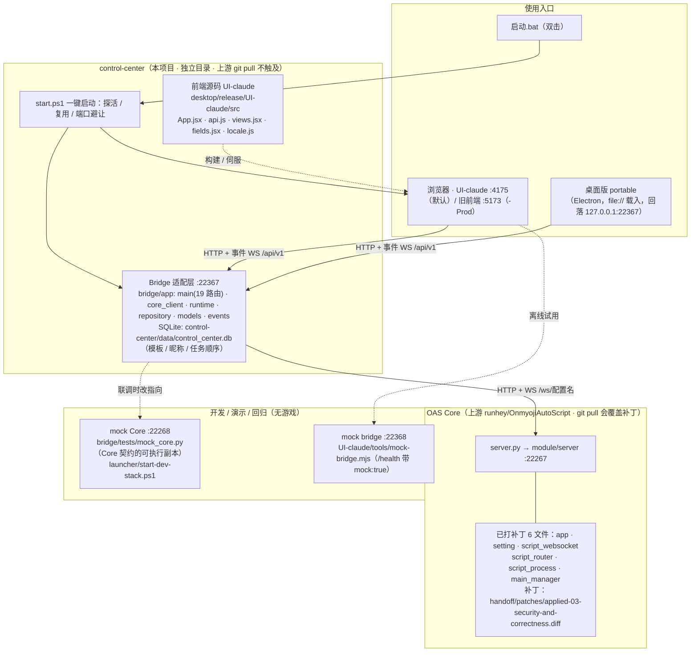

# 架构与兼容边界

> 本文是控制中心的架构总览，以及「架构图如何维护 / 更新」的留档。
> 架构图源文件：`control-center/docs/architecture.mmd`（Mermaid 纯文本，可 diff、可随 git 走）。

## 总览图

源见同目录 `architecture.mmd`。用 VS Code 的 “Markdown Preview Mermaid Support” 插件、
<https://mermaid.live> 或推到 GitHub/Gitee 都能直接渲染。下面这份内嵌副本需与 .mmd 保持一致
（改图规则见文末「架构图 · 维护与更新」）。



## 边界

前端只认识 Control Center API。它不读取 OAS 的 JSON 文件，不导入 OAS Python 包，也不依赖 QML/Pydantic 类名。

Bridge 是防腐层：

- 把 OAS 任务菜单转换为稳定的 `TaskSummary`；
- 把 OAS 参数 Schema 转换为统一的 `TaskConfig`；
- 把 OAS WebSocket 的 JSON 状态与文本日志转换为统一事件；
- 为每个配置账号维护一个独立的 WebSocket 运行时；
- 只在本地 SQLite 保存界面元数据（模板 / 昵称 / 任务顺序，位于 `control-center/data/control_center.db`）。

## 事件

事件格式见 `contracts/event.schema.json`。`seq` 只在 Bridge 进程内递增，前端重连后通过 REST 重新拉取账号、任务和日志，事件只负责实时更新。

## 线程隔离

每个 OAS 配置名对应一个 Core `ScriptProcess`，Bridge 为它创建一个独立的 `AccountRuntime`。开始 / 停止命令、状态和日志都带 `accountId`，因此切换账号不会共用任务配置或日志缓冲区。

## 端口约定

| 组件 | 端口 | 备注 |
|---|---|---|
| OAS Core | 22267 | 全局约定，`start.ps1` 不自动更换 |
| Bridge | 22367 | 被占用时 `start.ps1` 自动换 22368–22390 |
| UI-claude（新界面） | 4175 | 默认；被占用自动顺延 |
| 旧生产前端 | 5173 | 仅 `-Prod` 显式启用 |
| mock Core（演示栈） | 22268 | `launcher/start-dev-stack.ps1` |
| mock bridge（离线试用） | 22368 | `UI-claude/tools/mock-bridge.mjs` |

---

## 架构图 · 维护与更新

> **铁律：谁改架构，谁在同一次提交里改图。** 图与代码不一致时以代码为准，当天改图。

### 1. 图源放在哪（唯一事实来源）

- **源文件**：`control-center/docs/architecture.mmd`（Mermaid 纯文本）。选文本而非画图工具二进制，是为了**可 diff、可 review、随 git 走**；放在 `control-center/` 下，上游 `git pull` 永远不会碰它。
- **（可选）渲染产物**：`control-center/docs/architecture.svg`，与 .mmd 一起提交。
- **需同步的引用处**：本文件「总览图」内嵌代码块、`使用说明.md` 第 0 节的三层表、当次变更对应的 handoff 文档。

### 2. 用什么渲染

- **预览**（任选其一，无需给项目装任何依赖）：
  1. VS Code 装 “Markdown Preview Mermaid Support” 插件，直接预览 `.mmd` / md 里的 mermaid 代码块；
  2. 把 `.mmd` 内容粘进 <https://mermaid.live>；
  3. 推到 GitHub / Gitee，md 里的 mermaid 代码块自动渲染。
- **生成 SVG**（机器上已有 Node，前端本来就依赖它）：
  ```powershell
  Set-Location D:\OSAyys\control-center
  npx -y @mermaid-js/mermaid-cli -i docs\architecture.mmd -o docs\architecture.svg
  ```
  首次运行会联网下载 mermaid-cli；离线环境跳过此步，只提交 `.mmd`（预览工具里照常可看）。

### 3. 更新步骤（每次架构变更后执行）

1. **改源文件**：编辑 `control-center/docs/architecture.mmd`，只改文本；
2. **预览确认**无语法错误、连线与文字正确（第 2 节任一预览方式）；
3. **同步内嵌副本**：把新内容同步到本文件「总览图」的 ```mermaid``` 代码块（两处保持一致）；
4. **（可选）重新生成 SVG**（第 2 节命令；离线则跳过并标注“SVG 待重生成”）；
5. **对照实物验证**：跑 `.\control-center\check-wiring.ps1`，确认图上的端口与链路和探测一致；若本次动了 Bridge↔Core 契约，同时核对 `handoff/14` 第五节的契约表——**图、契约表、代码三者必须同步**；
6. **同步 `使用说明.md`** 第 0 节三层表（若端口 / 层级变了）；
7. **一起提交**：`.mmd`（和 `.svg`）与代码在同一次提交里，提交说明写明触发原因（见下表编号）。

### 4. 什么时候必须更新（触发条件）

| # | 触发条件 | 典型例子 |
|---|---|---|
| T1 | 端口 / 地址约定变化 | Core / Bridge / 前端默认端口调整，新增回落地址 |
| T2 | 层或组件增删 | 新增缓存层、去掉 mock bridge、UI-claude 转正替换旧前端 |
| T3 | Bridge↔Core 依赖接口变化 | `handoff/14` §5 契约表增删行（上游接口变了 / Bridge 新用了一个接口） |
| T4 | 上游补丁文件集合变化 | 新打了补丁、或某补丁被上游合入后从本地删除（PATCH 节点要同步增删文件名） |
| T5 | 启动方式 / 进程形态变化 | `start.ps1` 重构、桌面打包结构调整、新增守护进程 |
| T6 | 数据存储位置变化 | Bridge SQLite 迁移、模板存储方案变更 |

> 只改任务参数、翻译映射、界面样式、修 bug 不动结构 —— **不需要**更新架构图。
