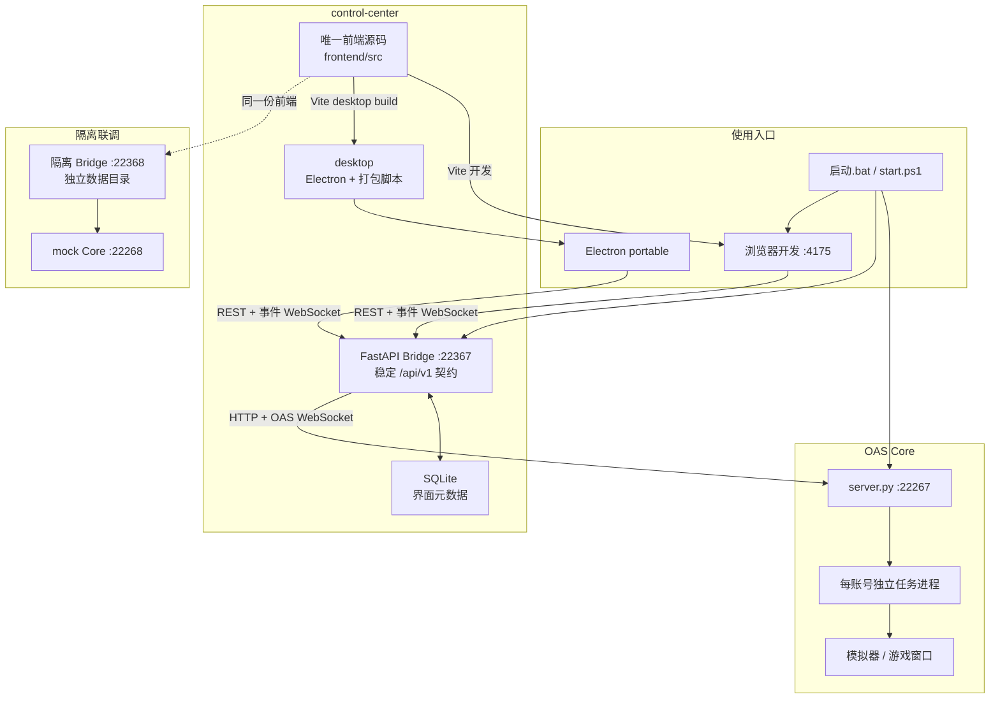

# 控制中心架构

本文档是控制中心架构的唯一事实源。Bridge REST/WebSocket 的字段和错误边界见同目录 contracts.md；OAS 业务任务仍由 Core 管理，不能从前端或通用工具复制一份。

图源是同目录的 `architecture.mmd`。当前架构坚持“一个前端源码、两个运行后端、一个桌面壳”：



## 边界

- `frontend` 只认识 Bridge 的 `/api/v1` 和事件 WebSocket。
- `bridge` 是上游防腐层，负责 Core 契约转换和界面元数据。
- `desktop` 只负责 Windows 窗口、Bridge 子进程和资源打包，不复制业务界面。
- `module`、`tasks` 和账号进程仍由 OAS Core 管理。
- 隔离测试必须使用 mock Core `22268`、Bridge `22368` 和独立数据目录，禁止指向正式 `22367` 执行写测试。
- 前端首选端口为 `4175`；启动脚本必须同时识别监听占用和 Windows 端口预留，并自动顺延到可绑定端口。

## 构建来源

```text
control-center/frontend
  -> npm run build -- --mode desktop
  -> control-center/desktop/ui
  -> electron-builder portable
```

`desktop/ui` 和 `desktop/release` 是生成物。源码修改只能发生在 `frontend`，否则下次构建会覆盖。

## 更新规则

改动端口、层级、启动方式、数据存储或打包来源时，应在同一次变更中同步更新 `architecture.mmd`、本文件、`control-center/README.md` 和相应的 `Codex-` 交接记录。
