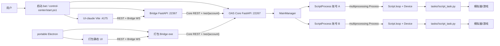
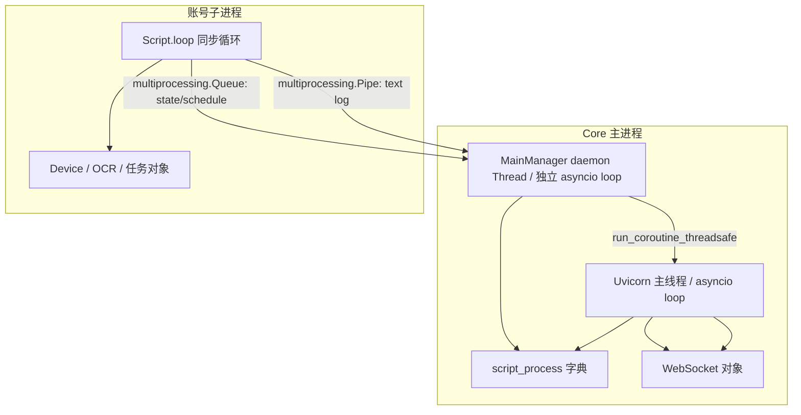
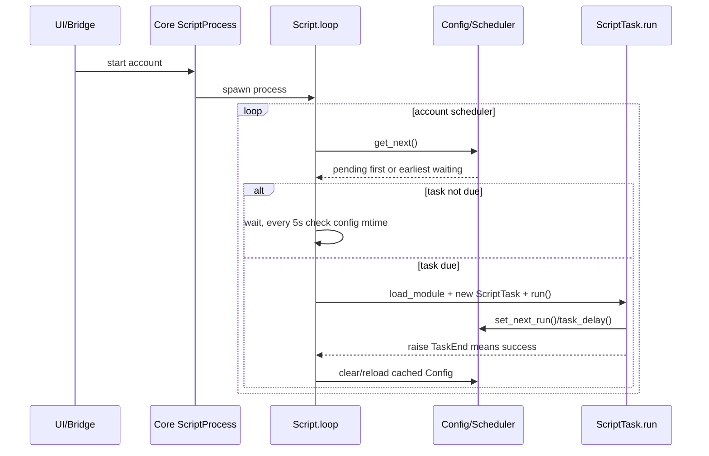

# Codex 01 项目架构与任务生命周期审计

审计日期：2026-07-29  
范围：`server.py`、`module/server/`、`module/config/`、`script.py`、`tasks/`、`control-center/`、根启动器和桌面打包链。  
结论基于当前未提交工作区，不等同于上游 `b7497a35` 原版。

## 1. 总体架构

### 1.1 启动层

- 根 `启动.bat:4` 只转发到 `control-center/start.ps1 -Menu`。
- `control-center/start.ps1:194-300` 依次处理 ADB、Core、Bridge、前端。默认前端是 `desktop/release/UI-claude` 的 Vite 开发服务 `:4175`；`-Prod` 才切到旧 `control-center/frontend :5173`。
- `server.py:83-91` 在 Uvicorn 前后管理 OCR 服务，实际 Core 入口是 `module.server.app:fastapi_app`。
- `server.py:75-76` 从 `config/deploy.yaml` 取地址；当前配置是 `127.0.0.1:22267`。

### 1.2 Core 服务层

- `module/server/app.py:24-35` 创建 FastAPI；`48-50` 注册 home、script、tool 三组路由。
- `module/server/app.py:57-66` 在启动时记录 Uvicorn 主事件循环，并按 `--run` 或部署配置恢复账号进程。
- `module/server/main_manager.py:24-31` 在 Core 导入期间为已有配置创建 `ScriptProcess`，并立即启动独立推送线程。
- `module/server/script_router.py:105-117` 的 REST start/stop 控制账号级脚本进程；`200-232` 的 Core WebSocket接收 `get_state/get_schedule/start/stop` 文本命令。

### 1.3 账号运行层

每个配置文件对应一个 `ScriptProcess` 主进程对象和最多一个任务子进程：

- `module/server/script_process.py:30-33` 创建日志 Pipe、状态 Queue、状态字段和子进程句柄。
- `35-48` 把状态先设为 RUNNING，再创建 `multiprocessing.Process`。
- 子进程入口 `123-162` 设置独立日志，创建 `Script(config_name)` 并进入 `Script.loop()`。
- `script.py:513-612` 是账号级常驻同步调度循环，一个账号内任务串行执行；不同账号由不同进程并行。
- 停止账号会在 `script_process.py:50-64` 直接 `terminate()`，0.7 秒后可能 `kill()`，没有任务级取消和资源清理握手。

### 1.4 Bridge 防腐层

Bridge 不执行游戏任务，它把 Core 的低层接口整理为控制中心契约：

- `control-center/bridge/app/core_client.py:18-46` 是 Core HTTP 客户端，最多 8 个并发请求。
- `control-center/bridge/app/main.py:180-186` 组合 Core 客户端、事件中心、SQLite 元数据仓库、账号运行态注册表和任务缓存。
- `/api/v1` 提供账号、任务目录、配置、窗口扫描、排期、日志、模板和动作接口，路由清单见 `main.py:311-613`。
- `control-center/bridge/app/runtime.py:60-235` 为被访问的账号建立一条 Core WebSocket，接收状态、排期和日志，再转成 Bridge 事件。
- SQLite 只应保存控制中心元数据、模板和显示顺序；Core 的 `config/*.json` 仍是任务配置事实源。

## 2. 进程、线程和事件循环边界

关键事实：

- Uvicorn WebSocket 属于主事件循环；`MainManager` 推送线程在 `main_manager.py:57-76` 用 `asyncio.run()` 创建另一事件循环。
- 当前二开在 `script_websocket.py:51-67` 用 `run_coroutine_threadsafe` 把实际 send 定向回主循环，修补了主要跨循环发送问题。
- `disconnect()`、连接列表读写、状态和日志发送顺序仍横跨两个事件循环，尚未形成单一拥有者模型。
- `MainManager`、REST 和 WebSocket 会无锁读写同一个 `script_process` 字典；推送协程创建后也没有注销生命周期。

## 3. 任务发现和执行

### 3.1 三处以上的隐式注册

新增任务通常至少要同时进入：

1. `module/config/config_model.py` 的导入和字段，决定账号 JSON 是否具有该任务配置。
2. `module/config/config_menu.py`，决定 UI 任务目录是否出现。
3. `module/config/config_manual.py:10-23` 的 `SCHEDULER_PRIORITY`，决定默认 Filter 是否保留到期任务。
4. `tasks/<Task>/config.py` 的 `scheduler` 字段和 `script_task.py` 入口。
5. Bridge 的中文标签目前还要手动进入 `control-center/bridge/app/main.py:42-62`，前端也有本地翻译表。

这是隐式契约，没有统一注册表或启动时完整性检查。`FindJade` 已在 ConfigModel 和菜单中，却不在 `SCHEDULER_PRIORITY`，是确定的静默漏执行例子。

### 3.2 调度不是持久队列

`TaskScheduler` 只对一次扫描所得列表排序，不拥有线程、定时器或持久队列：

- `module/config/config.py:178-212` 每次遍历整个 ConfigModel，按 `enable` 和 `next_run` 临时生成 pending/waiting。
- `module/config/scheduler.py:17-45` 只支持 Filter、FIFO、Priority 三种排序。
- 默认规则是 `tasks/Script/config_optimization.py:32` 的 `Filter`。
- Filter 只输出优先级字符串中匹配的对象，见 `module/base/filter.py:45-78`；未注册任务直接消失，不会追加或告警。
- `module/config/config.py:214-236` 优先取 pending 第一项，否则取最早 waiting 并等待。

### 3.3 普通任务和定时任务目前没有分层

静态检索到 52 个 `tasks/*/config.py` 使用同一类 `Scheduler`。当前概念只有：

- 账号调度器是否运行。
- 任务 `scheduler.enable` 是否参与扫描。
- `next_run` 是否到期。
- 任务自己在结束前如何写下一次时间。

所谓“手动执行某个任务”没有独立 `execute(task)` 运行请求。现有办法是修改该任务的 `next_run` 为现在，再由账号调度循环重新选择。`Config.task_call()` 也是在 `config.py:260-282` 修改 `next_run`；它默认 `force_call=True`，可绕过任务 enable，异常处理用它插入 `Restart`、`SoulsTidy`。

### 3.4 当前任务生命周期

任务成功依赖两个互不绑定的动作：任务自行写 `next_run`，再抛 `TaskEnd`。`script.py:451-459` 只在捕获 `TaskEnd` 时返回 `True`；普通 `return` 会得到 `None`，在 `581-601` 作为失败累计，三次后退出子进程。

## 4. 配置和运行状态

### 4.1 配置写入

- `ConfigModel` 每次从 `config/<account>.json` 整体加载，修改后整体覆盖。
- `module/config/utils.py:52-67` 和 `85-99` 的文件锁、原子写只能保护一次读取或一次写入，不能保护“读取、修改、写回”整个事务。
- Core HTTP 每次通过 `MainManager.config_cache()` 新建 `Config`，见 `main_manager.py:45-47`；任务子进程则长期持有自己的缓存模型。
- 因此前端写字段、任务写 `next_run`、异常触发 `task_call()` 并发发生时，后写者可能用旧模型覆盖先写者的其他字段。

### 4.2 三套容易冲突的状态

| 状态 | 来源 | 实际含义 |
|---|---|---|
| `ScriptProcess.state` | Core 主进程内存 | 账号进程期望状态，不一定反映子进程真实存活 |
| `ConfigModel.running_task` | 账号 JSON | 子进程最近写入的任务名，异常退出可能残留 |
| `schedule.running` | 新建 Config 调用 `get_next()` 后推导 | 只表示选中的任务已经到期，不保证进程正在执行 |

`script_router.py:207-221` 即使账号处于 INACTIVE，也会计算并发送 schedule；`config.py:242-245` 只检查任务时间是否已到，就填充 `running`。因此 UI 可能同时收到“已停止”和“某任务 running”。

## 5. 动态加载和热更新

- `script.py:452-457` 每次执行任务都用固定模块名 `script_task` 重新 `exec_module`。
- `module/base/utils/utils.py:891-902` 最后把模块写入 `sys.modules`。
- 任务主文件通常能在下一次任务加载时更新，但其普通 import 依赖仍使用 Python 缓存。
- RealmRaid 为调试 GeneralBattle，在 `tasks/RealmRaid/script_task.py:13-21` 主动 reload 公共模块。这只解决一个依赖，不是通用热更新机制。
- `ConfigWatcher` 把 mtime 截断到秒，见 `module/config/config_watcher.py:23-41`；同一秒内多次写入可能漏掉等待中断。

后续应把变更类型明确分成：配置热重载、任务入口重载、依赖模块重载、账号子进程重启、Core 服务重启，不能继续靠注释和经验判断。

## 6. 前端与打包来源

| 目录/产物 | 当前角色 | 是否是默认入口 |
|---|---|---|
| `control-center/desktop/release/UI-claude/` | React/Vite 新界面源码 | 是，`start.ps1` 默认从这里启动；桌面 `build.ps1` 也默认打它 |
| `control-center/frontend/` | 旧 React 前端 | 否，只有 `start.ps1 -Prod` 或 `build.ps1 -Ui frontend` 使用 |
| `frontend-preview/` | 单独静态样式/交互预览 | 否，不参与 portable 构建 |
| `control-center/desktop/ui/` | 最近一次桌面构建复制进去的静态快照 | 只供 Electron `loadFile()`，当前内容已落后 |
| `OAS-Control-Center-0.1.0-portable.exe` | 2026-07-26 的旧桌面产物 | 不是当前源码的构建结果 |

`desktop/release/` 被 `desktop/.gitignore:5` 整体忽略，导致默认 UI 源码位于通常不会提交的目录。当前 portable 和 Bridge 打包时间早于 7 月 27 日后续修改，也不能代表当前 UI/Bridge。

## 7. 建议保留的方向

- 保留 Bridge 作为稳定外部契约层，避免前端直接依赖 Core 的动态 Pydantic 和历史路由语义。
- 保留“每账号独立进程”的故障隔离思路，但运行态必须由进程监管器真实校准。
- 保留任务入口动态加载作为开发能力，但用显式 ReloadPolicy 取代任务内零散 `importlib.reload`。
- 保留截图回放、模板多版本和账号级配置方向，将共享可变规则对象逐步改成不可变定义或实例副本。
