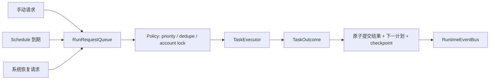

# Codex 03 通用接口与任务框架重构基线

审计日期：2026-07-29  
性质：后续设计基线，不是本轮实施方案。本轮未修改任何运行代码。

## 1. 重构目标

后续沉淀不应先整体重写，而应先给现有实现套上可验证边界，再按风险逐段替换。目标是：

1. 前端只依赖稳定 Bridge 契约，不直接理解 Core 历史细节。
2. 账号进程、任务实例、调度请求和运行事件各有唯一 ID 和事实源。
3. 普通手动任务与定时任务共享同一执行器，但触发方式、队列和取消语义分开。
4. 任务通过结构化结果提交成功、失败、重试和下一次时间，不再依赖“写时间 + 抛异常”。
5. 所有视觉等待和点击都有明确超时、结果和失败证据。
6. 配置更新是按字段/版本的原子事务，不会整文件互相覆盖。
7. 上游更新可以通过清单、补丁、契约测试和截图回放快速对照。

## 2. 建议模块边界

| 接口 | 单一职责 | 替代的现状 |
|---|---|---|
| `TaskDefinitionRegistry` | 任务 ID、配置模型、菜单、默认调度、标签、能力一次注册并校验 | ConfigModel、菜单、Filter、Bridge 标签多处手填 |
| `ConfigRepository` | 原子 patch、版本/CAS、迁移、按账号锁、变更事件 | 多个 Config 整体读取和覆盖 JSON |
| `SchedulerEngine` | 纯函数分类、排序、选择和下一唤醒时间 | Config 同时加载、排序、写回和展示 |
| `RunRequestQueue` | 持久化手动/定时触发请求，带 request_id、优先级和取消 | 修改 next_run 伪装成手动执行 |
| `ScriptRuntimeController` | 幂等 start/stop/restart/reconcile，generation 和真实存活状态 | ScriptProcess 手工状态字段 |
| `TaskExecutor` | 创建 TaskContext、执行任务、提交 TaskOutcome、发事件 | Script.run 的异常分支和 TaskEnd 协议 |
| `TaskContext` | device、vision、clock、config snapshot、checkpoint、cancellation | BaseTask 多重继承的大对象 |
| `ActionService` | wait/click/swipe/OCR 的统一结果、超时和证据 | 返回值不一致的 BaseTask 方法 |
| `RuntimeEventBus` | 统一进程、任务、调度、日志和配置事件 | state、schedule、running_task 三套状态 |
| `ConnectionHub` | 只在 Uvicorn 主循环拥有 WebSocket | 后台线程直接持有连接对象 |
| `CheckpointStore` | 业务任务的幂等恢复点 | RealmRaid 局部计数和进程重启从头跑 |
| `ReloadPolicy` | 明确何种改动可热更、需重启账号或需重启 Core | 任务内零散 importlib.reload |

## 3. 统一任务契约

建议任务不再通过异常表示正常结束：

```python
@dataclass(frozen=True)
class TaskOutcome:
    status: Literal['succeeded', 'retry', 'skipped', 'failed', 'cancelled']
    next_run: datetime | None
    reason: str
    retry_after: timedelta | None = None
    checkpoint: dict | None = None
    metrics: dict | None = None
```

约束：

- `TaskExecutor` 是唯一提交 `next_run` 的地方，结果和调度一次原子落盘。
- `run()` 正常返回 TaskOutcome；真正异常统一转为 failed，并保留 traceback 和最后截图。
- `skipped` 必须带下一次时间或明确禁用，禁止“TaskEnd 但 next_run 仍到期”的热循环。
- `retry` 必须说明是否消耗本次手动请求、何时重试、是否需要 Restart。
- 旧任务可先用 Adapter 把 TaskEnd/set_next_run 翻译成 TaskOutcome，不要求一次重写全部任务。

## 4. 普通任务与定时任务

两类任务应共享任务定义和执行器，但触发记录必须分开：

| 类型 | 触发来源 | 是否持久化 | 冲突策略 |
|---|---|---|---|
| 手动普通任务 | 用户点击、业务任务调用 | 是，形成 `RunRequest` | 可选择立即、排队、替换同任务请求 |
| 定时任务 | interval、cron、服务器更新时间、绝对时间 | 是，记录 schedule_id | 产生 RunRequest 后推进下一次计划 |
| 系统恢复任务 | Restart、设备修复、清理 | 是，标记 system | 有明确最高优先级和去重键 |



建议 RunRequest 至少包含：`request_id/account_id/task_id/source/requested_at/not_before/priority/dedupe_key/config_version/status`。这样“立即执行 RealmRaid”不再修改 scheduler.next_run，也能支持单任务取消、审计和重试。

## 5. 调度纯函数化

SchedulerEngine 可拆成三个纯函数：

```text
classify(definitions, schedules, now) -> due, future, invalid
order_due(due, rule) -> ordered
next_wakeup(future) -> datetime | None
```

规则要求：

- 未注册任务在启动校验阶段报错，不能由 Filter 静默丢弃。
- Filter 未匹配项必须明确配置为 append、reject 或 error，默认建议 error。
- `running` 只能来自 Executor 的活动 run_id，不得从“时间已到”推断。
- UI 排期和执行器使用同一 snapshot，状态结构应包含 `account_state/current_run/queued/future`。
- 使用可注入 Clock，单元测试无需等待真实时间。

## 6. 进程和事件模型

建议账号运行态：

```text
STOPPED -> STARTING -> IDLE -> RUNNING -> STOPPING -> STOPPED
                         |        |
                         |        +-> DEGRADED / CRASHED
                         +-> WAITING
```

每次 start 生成 `generation_id`，并新建该代 Queue/Pipe。所有状态、日志和结果事件都带 `account_id/generation_id/run_id/seq/timestamp`。父进程周期性 reconcile：

- 子进程死亡但状态非 STOPPED 时发 `process.exited`，转 CRASHED。
- 旧 generation 的迟到消息直接丢弃。
- start/stop/restart 在账号锁内幂等执行。
- stop 先发取消令牌，等待清理，超时才 terminate/kill。
- 配置 rename/delete 和监听协程注册/取消放在同一事务。

ConnectionHub 只存在于 Uvicorn 主循环；其他线程/进程只向线程安全队列写 RuntimeEvent，不持有 WebSocket。

## 7. 配置接口

Bridge `/api/v1` 建议继续作为唯一外部契约，但 Core 需要提供原子批量 patch：

```http
PATCH /v1/accounts/{account}/config
If-Match: "config-version-42"

{
  "changes": [
    {"path": "realm_raid.raid_config.target_level", "value": 59},
    {"path": "realm_raid.scheduler.enable", "value": true}
  ]
}
```

响应应包含新版本、逐字段规范化值和一次性验证结果。版本不一致返回 409，前端重读后提示冲突。Core 内部必须在同一账号锁中读取、验证全部字段、写临时文件并原子替换，不能逐字段整文件覆盖。

Bridge health 应至少报告：`instance_id/version/mode/core_url/data_dir/ui_build/capabilities`。启动器只有全部匹配才允许复用实例。

## 8. 视觉动作接口

建议所有低层动作返回结构化结果：

```python
ActionResult(
    status='matched' | 'acted' | 'timeout' | 'not_found' | 'failed',
    attempts=4,
    elapsed=2.7,
    match_score=0.83,
    rule='GB_EXIT_ENSURE',
    screenshot='log/evidence/...png',
    reason='confirmation_not_detected',
)
```

最低约束：

- wait、click-until、battle-wait、reward-wait 都必须显式 timeout；不允许公共接口默认永久等待。
- 返回 True 必须表示动作或目标真的完成；超时不得返回成功。
- 点击位置、识别目标和完成条件分开传入。
- 识别规则定义不可变；需要覆盖 ROI/keyword/threshold 时创建实例副本。
- 多模板保留，但模板组应有 ID、适用皮肤、阈值和离线回归样本，不再把 `|` 字符串作为最终接口。

## 9. 上游修补留档

建议每个上游补丁建立 manifest：

```yaml
id: realmraid-timeout-001
base_commit: b7497a35
files:
  - tasks/RealmRaid/script_task.py
patch: patches/realmraid-timeout-001.patch
tests:
  - tests/replay/realmraid_exit_confirmation.yaml
apply_check: git apply --check
reverse_check: git apply --check --reverse
upstream_status: local-only
```

要求：

- patch 必须使用仓库相对路径，可从干净 base commit 检查应用。
- 通用修复、业务定制、临时调试开关分成不同补丁。
- 图片资源记录尺寸、来源截图 hash、裁剪坐标和匹配样本。
- 当前工作区先保留，不在没有备份和测试时重排；后续建立专用分支/提交时再固化。

## 10. 迁移顺序

1. 冻结现状：把当前二开和文档纳入可恢复版本，修正不可应用补丁，不改业务行为。
2. 建契约测试：固定 Bridge OpenAPI、事件 schema、Core mock，并让 mock 使用独立数据库。
3. 修真实运行态：generation、reconcile、进程退出事件、幂等 start/stop。
4. 修配置事务：账号级原子 patch、版本号、Bridge 批量保存。
5. 引入 RunRequest 和 TaskOutcome Adapter，先不改旧任务主体。
6. 统一 ActionResult 和超时，优先覆盖 BaseTask、GameUi、GeneralBattle。
7. 用 RealmRaid 作为第一个状态机和 checkpoint 试点，完成后再推广到其他复杂任务。
8. 收口前端源码目录和 portable 构建，生成可追溯 build manifest。

## 11. 测试基线

- 纯单元测试：调度分类、Filter 未注册、next_run、配置 CAS、任务结果映射。
- 假设备测试：记录点击/滑动，不连接 ADB，验证返回值和超时。
- 截图回放：白天/夜间、破印、失败印、刷新 CD、票数、OCR 干扰样本。
- 进程测试：重复 start、子进程崩溃、旧 generation 消息、stop 超时、rename/delete。
- Bridge 契约测试：真实和 mock 使用同一用例，mock 数据目录强隔离。
- 启动器测试：错误 Core URL、旧 Bridge、端口占用、身份校验、自定义端口。
- portable 测试：构建来源 hash、Bridge/UI 版本一致、空数据种子、Core 离线提示。

这些测试都应能在不连接真实游戏的情况下运行；真实模拟器只保留最后一层验收。
