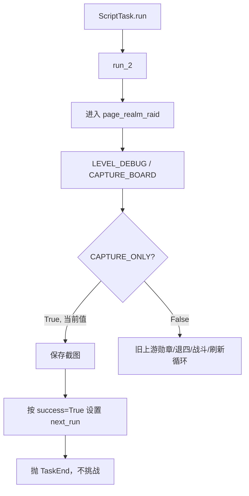
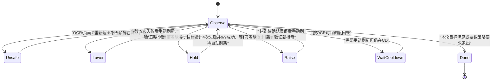

# Codex 04 个人结界突破半成品进度与规则

审计日期：2026-07-29  
对象：`tasks/RealmRaid/`、`tasks/Component/GeneralBattle/`、相关配置、资源、日志和 handoff 20 至 22。  
状态结论：当前是“上游个人突破 + 防卡死修补 + 等级 OCR/素材采集工具”，不是可用的卡级功能。

## 1. 用户已确认的业务规则

以下规则来自本轮对话，后续实现应视为需求基线：

1. 目标等级按账号单独配置，不能放在全局设置；判定严格按等级，不按玩家名字。
2. 当前挑战等级取九格等级的众数。OCR 无效格不能参与；实际执行前还需要最低有效格数和可信度门槛。
3. 进入任务时先识别当前页面已有的红色“破”和失败印记，作为本轮初始状态；不能假定任务从空白棋盘开始。
4. 红色“破”表示该目标已经挑战成功，不能继续挑战。成功才消耗结界突破券；失败/投降不扣券。券上限 30，来源随机。
5. 同一个目标可以连续投降，没有单目标投降次数限制；也可以把投降分散到多个目标。
6. 降级：当前轮累计失败/投降 9 次后，手动点击刷新。不能只看某一个格的失败印记数量。
7. 保级：累计失败/投降 4 次，并成功击杀当前页面全部 9 人。第 9 个成功后游戏自动刷新，不手点刷新。
8. 保级的“打九退四”只看最终总数，不限制先后顺序；自动刷新条件来自游戏的 9/9 成功机制。
9. 升级：投降和实际挑战失败合并计数，并且需要击败多个目标，然后手动刷新。具体失败阈值和“多个目标”的最小数量尚未确认。
10. 页面已有一个或多个“破”时，应直接计入当前轮成功数。图像识别优先于名字和内存计数。
11. 刷新有约 5 分钟 CD。程序不能把“刷新按钮没识别到”直接等同于“正在 CD”。
12. 刷新后的等级必须重新 OCR 验证，不能假定固定加一或减一。用户给出的实际例子中，约 60 级棋盘经过 9 次失败和手动刷新后出现约 58 级棋盘，因此应以新棋盘识别结果为准。

重要边界：同一个目标允许多次投降，但页面失败印未被证明会累计显示次数。如果同一格投降四次或九次，截图可能只能证明“该格至少失败过一次”。因此失败印只能作为页面证据或计数下限，不能直接把“失败格数量”当成“失败/投降总次数”；精确总数需要 checkpoint，或需要先验证游戏确实提供可识别的累计次数。

## 2. 当前已有能力

### 2.1 上游原功能

- 进入个人突破页面、切换御魂、锁定阵容尝试。
- 识别突破券数量和保留票数下限。
- 按勋章顺序选择可打目标。
- 旧“左上角退四”逻辑、普通战斗、三胜奖励、失败后的 Exit/Continue/Refresh、三胜刷新。
- 手动刷新按钮和确认弹窗处理。

### 2.2 已应用的防卡死修补

- handoff 20：锁阵容轮询、部分 wait、刷新确认和标题重试增加超时/日志。
- handoff 21：退出战斗的四个循环增加超时，识别不到确认按钮时按 ROI 中心兜底。
- handoff 22：RuleImage 支持白天/夜间多模板，补充庭院夜间探索入口。
- RealmRaid 入口对 GeneralBattle 做主动 reload，便于停止后重新启动账号测试公共战斗修改。

这些修补提高了可观察性，但没有完成卡级业务；其中退出流程仍未稳定，见第 4 节。

### 2.3 卡级开发已完成的感知层

`tasks/RealmRaid/script_task.py` 当前增加了：

- 棋盘原图和 OCR 调试图保存。
- 九格等级固定 ROI。
- 菱形铭牌掩膜、阈值二值化、放大和模糊预处理。
- 1 至 60 合法值过滤。
- 九格等级日志和众数函数。

这部分只负责“看到等级”，尚未负责“根据等级做动作”。

## 3. 当前实际入口



`run()` 明确调用 `run_2()`；旧 `execute_round()` 不可达，并引用已从配置注释掉的 `raid_mode`。因此不能把 execute_round 当作备用稳定流程。

## 4. 运行证据与文档冲突

### 4.1 退四没有真正闭环

`run_general_battle_back()` 的返回值表示退出流程是否完全顺利，但 RealmRaid 四次调用都忽略返回值，也不验证页面状态。

日志一：

```text
5383  GB_EXIT_ENSURE 识别不到，ROI 盲点
5385  GB_FALSE 没出现
5389  Title not found
5392-5400  连续点击 partition_1
5404  GameTooManyClickError
```

日志二：

```text
5794  GB_EXIT_ENSURE 盲点
5797  点击 GB_FALSE
5802  再次点击 partition_1
5805-5810  连点 GB_EXIT 后 GameTooManyClickError
```

所以 handoff 22 的准确结论只能是“超时后不再永久卡在同一个 while”，不能写成“打九退四已稳定”。

### 4.2 当前等级 OCR 没有最终运行验证

旧日志出现：

```text
5914-5927  60,59,60,8,0,59,60,160,59
6022-6030  60,59,601,60,59,59,60,10,59
```

当前源码后来加入新的菱形预处理和合法范围过滤，这会过滤 160/601，但日志中没有该最终版本的后续 RealmRaid 执行证据。源码注释写“9/9 全对”只能视为开发记录，不能替代可追溯测试样本。

### 4.3 素材采集假成功

日志 `5933-5939` 明确记录 `CAPTURE_ONLY=True`、不挑战、按 success=True 延后到次日。后续 UI 只看 TaskEnd 和 schedule 时，会把素材采集误显示为业务成功。

## 5. 尚未实现

| 能力 | 当前状态 | 缺失影响 |
|---|---|---|
| 每账号目标等级 | 无字段 | 无法决定降级、保级或升级 |
| 红色“破”识别 | 无 RealmRaid 规则 | 无法恢复成功数，可能重复挑战不可打目标 |
| 失败印识别 | 借用寮突破模板且只在 Continue 路径 | 当前默认 Refresh 下不生效，样式可靠性未知 |
| BoardSnapshot | 无 | 等级、成功、失败、票数和 CD 不是同一帧证据 |
| 降级状态机 | 无 | 不能累计 9 次后手动刷新并复核 |
| 保级状态机 | 无 | 不能处理已有破印、退四和第九胜自动刷新 |
| 升级状态机 | 无 | 阈值未确认，代码也未接入 |
| 刷新 CD | OCR 资源未使用 | 无法精确等待/调度，也无法区分模板失配 |
| 自动刷新代次 | 无 generation 判定 | 第九胜后可能继续在旧坐标操作 |
| 票数预算 | 只有 `number_base` 和尝试次数 | 尝试次数不等于胜场或票耗，重启又归零 |
| 中断恢复 | 无 checkpoint | Restart 后会从头重复动作 |
| OCR 可信度 | 只有值域过滤 | 单个合法误读也可能成为众数 |

## 6. 建议的棋盘事实模型

后续不要先根据内存计数操作，应先从同一张稳定截图构建快照：

```python
BoardSnapshot(
    generation_id,
    captured_at,
    levels=[...],
    valid_level_count=...,
    challenge_level=...,
    challenge_level_votes=...,
    broken={1, 4, 7},
    failure_marked={2, 3},
    observed_failure_lower_bound=2,
    checkpoint_failure_count=4,
    attackable={2, 3, 5, 6, 8, 9},
    tickets_current=...,
    tickets_total=30,
    refresh_available=...,
    refresh_cd=...,
    confidence=...,
)
```

最低安全规则：

- 等级、破印、失败印、票数和刷新状态必须来自同一稳定棋盘或明确标记采集时间。
- `broken + attackable + unknown` 应覆盖九格，冲突格进入 unknown，不执行消费票的挑战。
- `failure_marked` 只表示页面可见标记，不等于累计投降次数。动作计数和页面证据要分字段保存并在每次刷新后归属到新的 generation。
- 每个动作后重新观察，动作成功以页面证据为准，不以函数调用返回或名字为准。
- 自动刷新通过棋盘 generation 变化确认，例如九格标记清空、等级/对手布局显著变化和页面稳定，不依赖固定 sleep。
- OCR 不达门槛时只记录/重试，不进行升降级决策。

## 7. 状态机草案



这是分析草案，不应直接照图编码。尤其 Raise 的阈值和游戏等级跳变仍需用户补充。

## 8. 动作事务建议

### 8.1 投降一次

1. 从 BoardSnapshot 选择允许重复投降的目标。
2. 点击目标并确认进入战斗准备/战斗页。
3. 执行退出，必须确认退出弹窗、失败结算和返回 RealmRaid 页面三段证据。
4. 重新构建 BoardSnapshot。
5. 只有页面证据成立才把本轮投降计数加一；失败则保留 checkpoint 并停止消费后续动作。

### 8.2 成功挑战一次

1. 只选择没有“破”且可挑战的格。
2. 战前记录票数和目标格。
3. 战后必须识别该格出现“破”，或自动刷新产生新 generation。
4. 票数变化只做交叉验证；不能用 `current_count` 代替成功数。

### 8.3 手动刷新

1. 确认当前模式允许手动刷新，且失败/成功条件满足。
2. 识别按钮和 CD OCR；在 CD 时保存 checkpoint 并把任务调度到到期后。
3. 点击刷新和确认。
4. 等待新 generation，重新 OCR 等级并比较目标。

## 9. 仍待用户确认

前面已经确认的“降级 9、保级 4、同目标可重复、保级第九胜自动刷新、账号独立目标”等不再重复询问。当前真正会改变实现的未确认项是：

1. 升级所需的失败/投降总数，以及“击败多个目标”最少是几个；顺序是否完全不限。
2. 当前等级低于、等于、高于目标时是否固定对应升级、保级、降级；游戏出现一次跨两级或等级跳变时如何继续。
3. 票数不足以打完计划时的退出策略。已有破印应计入成功数，但剩余票数不足时是结束、只投降、还是等待日常补票。
4. 需要手动刷新但 CD 未结束时，是留在页面等待，还是退出任务并精确调度到 CD 到期。建议后者，但需确认。
5. 红色“破”和失败印是否存在活动皮肤/不同样式；同一格是否可能同时出现两类标记。
6. 等级 OCR 最少成功几格、众数至少几票才允许执行。建议至少 6 格有效且众数不少于 4 票，但这只是安全建议。
7. `number_attack` 最终限制的是战斗尝试、胜场、票耗还是整个任务动作数；`number_base` 是否继续保留为额外安全下限。
8. 同一目标连续投降时，失败印是否会显示累计次数或不同状态；如果只显示一个标记，中断恢复应以持久化 checkpoint 为准，并规定 checkpoint 与当前棋盘 generation 不一致时如何保守处理。

## 10. 下一次开发前检查

1. 先把当前未提交代码、图片和文档固化为可恢复基线。
2. 修正两个不可应用补丁，给 handoff 22/23 和 QML 修改补 manifest。
3. 用现有棋盘截图离线完成等级、破印、失败印、票数和刷新 CD 的回放测试。
4. 先实现只读 BoardSnapshot，不点击游戏；人工对照至少多种棋盘。
5. 再实现单次“投降事务”和单次“成功挑战事务”，不直接接完整状态机。
6. 最后接降级、保级、升级和 checkpoint，并保持原上游流程可切换回退。

本轮只记录进度和根因，未关闭调试开关、未新增配置字段、未裁模板、未修改任务流程，也未进行真实任务验证。
