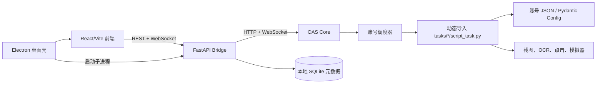
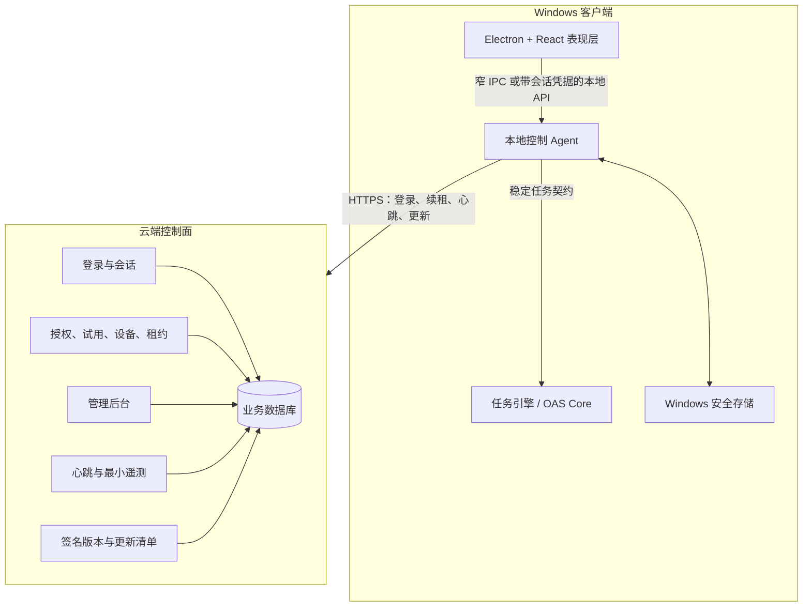

# Codex 08 授权服务与客户端代码保护架构审查

日期：2026-08-03  
分支：`codex/mk6657-secondary-development`  
性质：架构审查与后续实施基线；2026-08-03 已按项目负责人确认更新权属前提，本轮不加入授权、加密或业务功能代码

## 1. 结论

当前项目已经完成了进程和 API 层面的前后端分离，但尚未完成运行功能的领域化拆分。

| 维度 | 当前估分 | 结论 |
|---|---:|---|
| 界面与后端进程分离 | 78/100 | React 只访问 Bridge，Electron 复用同一份前端，方向正确 |
| Bridge 与上游 Core 隔离 | 65/100 | 已有稳定 `/api/v1` 适配层，但 Bridge 主文件仍承担过多职责 |
| 调度、任务、设备、识别逻辑分离 | 42/100 | Core 内仍是集中式调度器加动态任务导入，任务直接依赖 Config 和 Device |
| 正式发布与客户端安全 | 23/100 | 有基础 Electron 沙箱设置，但没有授权、本地 API 鉴权、签名更新和可靠数据净化 |
| 可直接做闭源商业发布 | 30/100 | 上游作者团体的完整处置授权已由 MK6657 确认；仍需完成第三方代码审计、正式许可证切换、授权服务和发布加固 |

不能把当前 `portable.exe` 理解为“全部功能已经封装和加密”。它目前只是 Electron 壳、静态前端和 PyInstaller Bridge；真正执行游戏、OCR、设备和任务流程的 OAS Core 仍是外部 Python 项目。

## 2. 当前真实链路

已分离部分：

- `control-center/frontend/src/api.js` 统一访问 Bridge 的 `/api/v1`，前端不直接读 `config/*.json`，也不导入 Python 模块。
- `control-center/bridge/app/core_client.py` 把上游 Core 的 HTTP/WebSocket 契约隔离在适配层。
- `control-center/desktop/main.cjs` 只负责桌面窗口、Bridge 子进程和资源目录，不承载游戏流程。
- Core 为每个账号创建独立任务进程，账号之间已有进程级隔离。

尚未分离部分：

- `script.py` 同时承担调度循环、设备生命周期、任务动态加载、异常恢复、游戏重启和日志保存。
- `script.py` 通过任务目录名动态导入 `tasks/<Task>/script_task.py`，再直接构造 `ScriptTask(config, device)`；没有稳定的任务运行接口或依赖注入边界。
- 任务类普遍直接读取 `self.config`、读取 `self.device.image` 并点击设备，识别、决策、动作和调度回写混在同一类里。
- `module/config/config_model.py` 静态导入大量任务配置，新增或删除任务会影响中心配置模型。
- `control-center/bridge/app/main.py` 同时包含窗口扫描、ADB 映射、Core 适配编排、缓存、SQLite 元数据和全部路由，后续接授权会继续膨胀。
- `tasks/RealmRaid/level_mode.py` 已经提供纯 `decide_next_action()`，证明“识别结果 -> 决策”可以脱离 Device/OCR 单测；但 checkpoint 文件持久化仍与领域模型同文件，后续可继续拆成 repository 端口与文件适配器。

因此，当前可以继续用网页热更新开发 UI，但不要现在就对整个 Python 树做加壳或混淆。否则每次调试、上游同步和流程修复都会显著变慢。

## 3. 当前发布与安全问题

### P0：授权和本地控制面没有安全边界

- Bridge 和 Core 没有有效的访问令牌或调用方身份。`server.py` 和 `module/server/app.py` 虽声明 `--key` 参数，但当前没有看到它被用于路由鉴权。
- Bridge 与 Core 的 CORS 只允许本机来源，但 CORS 是浏览器策略，不是服务端身份认证；本机其他程序可以直接调用启动、停止、删账号和改配置接口。
- 当前 `config/deploy.yaml` 把 Core 绑定到 `127.0.0.1`，但代码和默认模板仍允许 `0.0.0.0`。正式版本必须强制回环地址，不能依赖用户配置碰巧正确。

### P0：构建会复制真实本地数据

`control-center/desktop/build.ps1` 当前把正在使用的 `control-center/data/control_center.db` 复制成安装包的 `data-seed/control_center.db`。正式构建必须改成由迁移脚本生成空库，禁止从开发机复制数据库、账号元数据、任务顺序或模板。

### P1：当前打包不等于加密

- Electron ASAR 是归档格式，只能遮挡随手查看，不能保护 JavaScript 源码。
- PyInstaller `--onefile` 会把 Python 字节码和依赖打包并在运行时解包，不是不可逆编译。
- 混淆、资源加密和反调试都只能提高分析成本。只要密钥和算法必须在用户机器运行，具备足够能力的分析者最终可以获得运行时明文。
- 真正不能泄露的服务器私钥、授权规则、管理接口凭据和全局风控规则不能进入客户端。

### P1：发布完整性尚未建立

- 当前没有 Windows Authenticode 签名、强制签名构建、签名更新清单或版本撤回机制。
- Electron 已开启 `contextIsolation`、关闭 `nodeIntegration`、开启 `sandbox` 并禁止新窗口，这是正确基础；但生产版仍使用 `file://`、暴露开发者工具菜单，且没有记录明确的 CSP、导航拦截、Electron Fuses 和 ASAR Integrity 配置。
- `portable` 适合当前测试，但正式自动更新、修复和撤回更适合带安装器的稳定版。可以同时保留测试 portable 和正式安装版。

### P1：日志与在线数据边界未定义

现有错误处理会保存截图和日志。未来在线后台默认只应接收最小运行指标，不能自动上传截图、账号名、完整日志、令牌或设备原始硬件标识。诊断包必须由用户明确触发并在上传前脱敏。

## 4. 项目授权与第三方许可证边界

MK6657 已明确确认：上游作者团体已通过群聊和电话授予其完整代码处置权限，范围包括使用、修改、二次或三次开发、团体内部使用、商业化和许可证处理。该事实作为本地项目后续规划的确定前提，由 MK6657 负责本地二开、验收和发布决策，统一记录在 `legal/PROJECT-AUTHORITY.md`。

因此，本项目不再把“是否能取得上游商业许可”作为架构阻塞项。可以按自有产品路线规划闭源客户端、服务器授权校验、商业发行和代码保护。仓库当前根 `LICENSE` 与 README 仍保留历史 GPLv3 口径，本轮只完成归档；未来应在一个明确、可回退的许可证切换提交中同步更新根许可证、README、安装包和关于页面，历史 GPL 文本保存在 `legal/licenses/GPL-3.0-upstream.txt`。

需要单独处理的是独立第三方来源。README 和源码明确存在来自 AzurLaneAutoScript、StarRailCopilot、FluentUI、python-atomicwrites、cached-property、Bottle、gurs 等项目的代码或组件。OAS 上游团体的授权不自动覆盖这些独立权利人的内容；在正式闭源发行前，需要按 `legal/THIRD-PARTY-NOTICES.md` 逐项选择保留原许可证边界、取得许可或重写替换。

近期路线调整为：保留现有 Core 作为可工作的二开基础，先完成领域接口、独立授权服务和安全发布底座；同时清理第三方来源边界。是否重写某个模块由维护成本、性能和第三方许可证审计结果决定，不再因为上游 OAS 授权本身而默认要求洁净室重写。

## 5. 推荐目标架构

### 客户端职责

- 前端只显示状态和收集用户操作，不保存私钥，不决定账号是否有权使用功能。
- 本地 Agent 负责登录回调、令牌安全存储、授权租约校验、Bridge/Core 生命周期、本地接口身份验证和更新。
- Core 只执行任务、调度、识别和设备操作；Core 必须自行验证服务器签名租约，不能只信任前端或 Bridge。授权检查放在进程启动和任务派发入口，不放进每次 OCR、截图或点击循环。
- 开发版保持 Python/Vite 热更新；发布版才执行编译、完整性校验、签名和调试信息处理。

### 云端职责

- 用户、管理员、授权套餐、试用期、设备名额、会话、撤销、版本策略和审计日志的唯一事实来源在服务器。
- 签发短期访问令牌和短期授权租约；签名私钥保存在 KMS/HSM 或至少严格隔离的服务器密钥存储中，绝不放入客户端。
- 管理后台执行停用用户、延长试用、撤销设备和查看在线状态；所有管理写操作都产生不可修改的审计事件。
- 服务器拒绝过期、停用、设备超额、版本过低或重放的请求。

## 6. 授权流程

推荐桌面登录使用系统浏览器的 Authorization Code + PKCE，或在现有后台无法支持 OAuth 时使用一次性设备码。桌面客户端属于公开客户端，不能依靠内置的共享 `client_secret` 证明自身身份。

1. 首次运行时，本地 Agent 生成每安装实例的非导出或受系统保护密钥对，并得到随机 `installation_id`。
2. 用户通过系统浏览器登录，客户端用 PKCE 或一次性设备码换取短期 access token 与可轮换 refresh token。
3. refresh token 使用 Electron `safeStorage`/Windows DPAPI 或 Windows Credential Manager 保存，不写入 JSON、SQLite、前端 localStorage 或日志。
4. Agent 请求授权租约，服务器校验用户状态、试用截止时间、设备名额、版本和功能权益。
5. 服务器返回非对称签名的短期租约，至少包含 `subject`、`installation_id`、`features`、`issued_at`、`expires_at`、`lease_id`、`minimum_version`。
6. Agent 只内置服务器公钥，在本地离线验证租约；启动任务前检查一次，运行中异步续租。
7. 心跳建议每 3 到 10 分钟带随机抖动，授权租约建议 30 到 60 分钟。离线宽限期由产品策略决定，建议测试期先设 24 小时。
8. 用户被停用或设备被撤销后，服务器拒绝续租。离线场景不可能做到真正即时撤销，最坏延迟等于剩余租约加离线宽限期；若要求即时停用，就必须选择始终在线。

为了不影响性能，授权网络请求在独立后台任务中进行；截图、OCR 和点击热路径只读取内存中的已验证授权快照，单次开销可以控制在常量级。

## 7. 最小数据模型

| 表/实体 | 核心字段 | 用途 |
|---|---|---|
| `users` | id、status、created_at、disabled_at | 用户主体，建议停用/软删除而不是直接物理删除 |
| `entitlements` | user_id、plan、features、starts_at、expires_at | 正式授权和功能权益 |
| `trial_adjustments` | user_id、delta_seconds、reason、admin_id | 延长或缩短测试时间，保留每次变更来源 |
| `installations` | id、user_id、public_key、label、status、last_seen_at | 每台安装实例和撤销状态 |
| `sessions` | user_id、installation_id、refresh_hash、expires_at、revoked_at | 登录会话和 refresh token 轮换 |
| `leases` | lease_id、installation_id、issued_at、expires_at、revoked_at | 授权租约与重放/撤销审计 |
| `heartbeats` | installation_id、version、state、received_at | 在线状态和最小运行指标，按保留期归档 |
| `admin_audit_events` | actor、action、target、before、after、request_id、created_at | 管理后台所有敏感操作审计 |
| `releases` | version、channel、sha256、signature、minimum_version | 签名发布、灰度、最低版本和撤回 |

推荐管理操作：

- 停用/恢复用户，而不是直接删除后失去审计链。
- 增加测试时长时写入 `trial_adjustments`，不要直接无记录地覆盖到期时间。
- 单独撤销某台设备、全部会话或全部授权。
- 查看最近心跳、客户端版本、授权状态和最后一次任务结果摘要。
- 管理员启用 MFA，并按客服、运营、审计、超级管理员拆分权限。

## 8. 本地进程安全

近期可以保留 HTTP/WebSocket，但至少加入以下边界：

- Core 和 Bridge 强制只监听 `127.0.0.1`，启动时拒绝 `0.0.0.0`。
- Electron/启动器为每次运行生成随机会话能力令牌，Bridge 的 REST 和 WebSocket 都必须校验；Bridge 到 Core 使用独立令牌。
- WebSocket 使用短期一次性 ticket 或受保护会话，不把 refresh token、长期 access token 或设备私钥放进 URL 查询参数。
- 生产 Electron 使用自定义 `app://` 协议、严格 CSP、禁止任意导航、禁用生产开发者工具入口。
- 更稳的后续方案是在 Windows 上把 Agent 的高权限接口迁到带 ACL 的 Named Pipe；前端只通过经过参数校验的 preload IPC 调用，避免把通用控制 API直接暴露给任意本机网页。
- CORS 继续保留作为浏览器层的附加防护，但不再把它视为身份认证。

## 9. 代码保护与发布策略

### 应保护什么

- 最高优先级：服务器签名私钥、管理员凭据、授权规则、风控规则。这些内容不进入客户端。
- 中优先级：自有 Agent、未来洁净室任务引擎、授权协议实现、发布更新逻辑。使用本地编译、完整性检查和代码签名提高修改成本。
- 低优先级：React 页面样式和普通 DTO。只做常规压缩，不值得用高强度混淆牺牲可维护性。

### 发布版加固

- Electron：保留 sandbox/contextIsolation/nodeIntegration 安全设置，加入 CSP、导航白名单、自定义协议、Fuses、ASAR Integrity，并从生产菜单移除 DevTools。
- Windows：对主 EXE、Bridge/Agent、Core 和更新器做 Authenticode SHA-256 签名与 RFC 3161 时间戳；发布流水线在缺少签名时必须失败。
- Python：PyInstaller 继续用于开发测试；生产阶段先解决 `tasks/*/script_task.py` 动态路径加载与静态收集清单，再验证 Nuitka 对 Bridge/自有 Agent 的兼容性和性能。商业级常量或数据保护只用于本项目有权闭源处置、且已完成第三方来源审计的模块。
- 更新：服务器提供签名 manifest、文件 SHA-256、发布通道和最低兼容版本；客户端同时验证 manifest 签名、文件哈希和 Authenticode。
- 构建：从干净检出和空数据迁移生成产物；密钥只从 CI 密钥存储注入，不进入仓库和构建日志。

## 10. 建议实施顺序

### 阶段 0：固化授权和产品策略

1. 维护 `legal/` 权属档案，完成第三方来源审计，并确定正式自有许可证全文与切换版本。
2. 确定是否允许离线、离线多久、每用户设备数和需要采集的在线数据。
3. 提供现有后台的技术栈、域名/TLS、数据库和现有用户接口，决定复用还是新增授权服务。

### 阶段 1：修发布底座

1. 构建改为空数据库种子并增加秘密/隐私扫描。
2. 强制 Core/Bridge 回环监听，增加本地进程鉴权。
3. 增加版本清单、构建来源、签名占位和开发/发布配置分离。
4. 增加 CSP、导航限制和生产 DevTools 控制。

### 阶段 2：沉淀运行接口

1. 定义 `TaskContext`、`TaskResult`、`TaskRunner` 和取消/超时协议。
2. 把调度、任务决策、识别、设备动作和状态持久化逐步拆开。
3. 先用 RealmRaid 作为第一个新接口适配样板，不立即迁移所有上游任务。
4. Bridge 拆成路由、应用服务、Core 适配器、Windows 设备发现和本地仓储模块。

### 阶段 3：授权后台 MVP

1. 实现用户、授权、试用调整、设备、会话、租约和审计表。
2. 实现登录/激活、租约签发/续租、心跳、设备撤销和管理员延时接口。
3. 管理后台先满足查看在线、停用用户、增加测试时间和撤销设备四项核心操作。
4. 为每个授权判断和管理员写操作补齐单元与集成测试。

### 阶段 4：客户端授权接入

1. 增加系统浏览器登录或设备码登录。
2. 加入安全存储、短期租约缓存、后台续租和明确的离线/过期提示。
3. 在账号进程启动和任务派发入口设置授权门，不侵入 OCR/点击热路径。
4. 增加断网、改时钟、令牌重放、设备撤销、服务故障和后台延时的测试矩阵。

### 阶段 5：正式保护与更新

1. 验证 Nuitka/本地编译方案，再决定是否采购商业保护工具。
2. 开启 Electron Fuses/ASAR Integrity 和 Windows 签名。
3. 发布签名更新清单、灰度通道、最低版本和紧急撤回。
4. 做一次独立逆向与篡改测试，依据真实结果调整，不堆叠高开销反调试。

## 11. 下一步需要用户确认

进入实现前只需要确认以下产品决策：

1. 现有后台使用什么语言、框架、数据库，是否已有 HTTPS 域名和登录系统。
2. 客户端必须始终在线，还是允许建议的 24 小时离线宽限。
3. 一个用户允许绑定几台设备，换机是否由用户自助解绑。
4. 后台“在线数据”具体需要哪些字段；默认建议只收版本、在线状态、授权状态和任务结果摘要。
5. 正式自有许可证采用仅内部授权、按用户订阅授权还是其他商业条款，以及首个切换版本号。

## 12. 官方参考

- GNU GPLv3 FAQ：修改版二进制对应源代码、聚合与独立程序边界  
  https://www.gnu.org/licenses/gpl-faq.en.html
- Electron Security Checklist  
  https://www.electronjs.org/docs/latest/tutorial/security
- Electron ASAR Integrity  
  https://www.electronjs.org/docs/latest/tutorial/asar-integrity
- Electron Fuses  
  https://www.electronjs.org/docs/latest/tutorial/fuses
- Electron safeStorage  
  https://www.electronjs.org/docs/latest/api/safe-storage
- OAuth 2.0 for Native Apps / PKCE  
  https://www.rfc-editor.org/rfc/rfc8252.html
- OAuth 2.0 Security Best Current Practice  
  https://www.rfc-editor.org/rfc/rfc9700.html
- Microsoft Authenticode time stamping  
  https://learn.microsoft.com/windows/win32/seccrypto/time-stamping-authenticode-signatures
- PyInstaller one-file extraction behavior  
  https://pyinstaller.org/en/stable/usage.html
