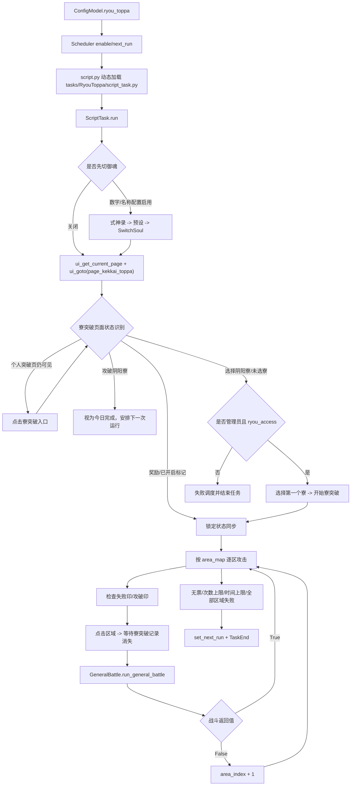

# Codex-34 阴阳寮突破链路审查

审查日期：2026-08-05  
审查对象：`tasks/RyouToppa/` 及其页面、通用战斗、设备、调度依赖  
审查目的：给“狐妖”后续开发提供现状、调用链、复用边界和可验证的风险清单  
本轮状态：只读审查；没有启动 `RyouToppa`，没有点击游戏，没有修改业务代码和配置。

## 1. 结论摘要

项目中确实存在独立的阴阳寮突破任务，内部任务名是 `RyouToppa`，界面中文名由 i18n 映射为“寮突破”。它不是个人结界突破 `RealmRaid` 的一个配置分支，而是一个单独的 `ScriptTask`，通过个人突破页面右上角入口进入寮突破页面。

当前代码可以复用以下基础能力：

- `GameUi` 的页面识别和页面跳转。
- `GeneralBattle` 的普通战斗准备、预设、御魂提示、绿标和战斗结算。
- `SwitchSoul` 的式神录预设/御魂切换。
- `Device` 的截图、OCR、模板匹配和 1280×720 坐标控制。
- 根调度器的任务加载、`TaskEnd`、成功/失败后的下一次调度。

但寮突破自身仍是上游式旧循环，和最近个人突破的状态机、checkpoint、准备契约没有统一。当前最危险的不是单个坐标，而是状态语义混用：

- 页面未识别、点击失败、区域不可用和战斗失败最终经常只表现为 `False` 或继续循环。
- 多个入口循环使用无上限 `while 1`，模板失配时可能长时间占住调度器。
- `skip_difficult` 已进入配置模型，但没有任何执行代码读取它。
- 寮奖励资源被定义，但任务流程中没有明确的战后奖励消费链路。
- 当前没有 `tasks/RyouToppa` 专项测试；只有一个位于 `Hyakkiyakou/utils` 的旧式人工测试辅助类。

因此建议狐妖先按“单次进入/单次攻击/单次结算/单次奖励/退出调度”拆开验证，再接回整轮循环。暂不建议直接打开 `oas1` 的寮突破调度进行长程实机测试。

## 2. 当前账号状态

来源：`config/oas1.json:234-270`。

| 项目 | 当前值 | 结论 |
|---|---|---|
| `ryou_toppa.scheduler.enable` | `false` | 当前不会被调度器执行 |
| `ryou_toppa.scheduler.next_run` | `2023-01-01 00:00:00` | 因任务关闭暂不生效；以后开启前必须重新设定 |
| `raid_config.limit_time` | 30 分钟 | 任务级软时间上限 |
| `raid_config.limit_count` | 50 | 最大攻击尝试数 |
| `raid_config.ryou_access` | `false` | 不允许按管理员流程主动开启寮突破 |
| `raid_config.skip_difficult` | `true` | 当前代码没有实际读取，等同未实现 |
| `raid_config.random_delay` | `false` | 不增加攻击前随机延迟 |
| `general_battle_config.preset_enable` | `false` | 不执行战斗前队伍预设切换 |
| `general_battle_config.green_enable` | `false` | 不执行绿标 |
| `general_battle_config.lock_team_enable` | `false` | 进入攻击前会走未锁定阵容的准备分支 |
| `switch_soul_config.enable` | `false` | 不按数字组队切御魂 |
| `switch_soul_config.enable_switch_by_name` | `false` | 不按名字切御魂 |

注意：如果只把 `scheduler.enable` 改成 `true`，旧的 `2023-01-01` 已经早于当前时间，调度器会把它当成待运行任务。后续测试必须先设置明确的测试时间，并确认游戏处于允许接管的页面。

当前工作树本身已有大量上游二开和审查中的改动（本次审查前统计为 98 个已修改条目、70 个未跟踪条目）。本报告没有覆盖、回退或重排这些已有改动。

## 3. 完整调用链

### 3.1 调度与任务加载

1. `ConfigModel` 注册 `ryou_toppa`：`module/config/config_model.py:96-98`。
2. 任务菜单注册为 `RyouToppa`：`module/config/config_menu.py:34-35`。
3. 调度优先级中 `RealmRaid` 在 `RyouToppa` 前：`module/config/config_manual.py:10-14`。两者都到期时，个人突破会先被调度。
4. 根调度器根据配置动态加载 `tasks/<command>/script_task.py`：`script.py:451-458`。
5. `TaskEnd` 会被根调度器转换成成功返回：`script.py:458-459`；随后调度器清理 `running_task` 并决定下一个任务：`script.py:570-615`。

### 3.2 进入寮突破页面

`ScriptTask.run()` 先处理可选的式神录切换：`tasks/RyouToppa/script_task.py:89-98`。然后识别当前页面并跳转到 `page_kekkai_toppa`：`tasks/RyouToppa/script_task.py:99-100`。

页面关系由 `tasks/GameUi/page.py:89-97` 定义：

- `page_exploration -> page_realm_raid`：进入个人结界突破页面。
- `page_realm_raid -> page_kekkai_toppa`：点击 `RyouToppaAssets.I_RYOU_TOPPA`，即个人突破页面右上角的寮突破入口。
- `page_kekkai_toppa -> page_realm_raid`：通过 `G.I_RYOUTOPPA_GOTO_REALMRAID` 返回个人突破。

寮突破页面本身用 `G.I_KEKKAI_TOPPA` 识别，见 `tasks/GameUi/assets.py:235`。

### 3.3 寮突破开关状态

进入目标页后，任务在 `tasks/RyouToppa/script_task.py:105-130` 使用一个无超时循环等待以下状态：

- `RealmRaidAssets.I_REALM_RAID`：仍处于个人突破入口场景时，点击个人突破图标后继续识别。
- `I_REAL_RAID_REFRESH`：检测到个人突破刷新区域后，点击寮突破入口。
- `I_SUCCESS_PENETRATION`：识别到“攻破阴阳寮”，直接认为今日已完成。
- `I_SELECT_RYOU_BUTTON`：出现选择阴阳寮按钮，判定寮突破尚未开启，并设置管理员候选标记。
- `I_NO_SELECT_RYOU`：出现未选择阴阳寮状态，判定寮突破尚未开启。
- `I_RYOU_REWARD` 或 `I_RYOU_REWARD_90`：识别到寮突破相关奖励/已开启状态。

这里没有一个显式的 `PageState` 或 `Unknown` 分支。任何模板都没有命中时，代码会继续截图和轮询，直到外层进程或设备看门狗介入。

### 3.4 管理员主动开启流程

当寮突破未开启且 `ryou_access=True`、同时识别到 `I_SELECT_RYOU_BUTTON` 时，调用 `start_ryou_toppa()`：`tasks/RyouToppa/script_task.py:133-141`。

内部步骤：

1. 等待并点击 `I_SELECT_RYOU_BUTTON`：`script_task.py:209-214`。
2. 等待 `I_GUILD_ORDERS_REWARDS`，点击固定的 `C_SELECT_FIRST_RYOU`：`script_task.py:216-221`。
3. 等待并点击 `I_START_TOPPA_BUTTON`，直到出现 `I_RYOU_REWARD`：`script_task.py:223-230`。

静态事实：管理员流程固定选择列表中的第一个寮，没有账号级的目标寮名称/唯一标识配置。三个步骤都是无超时循环；第三步只等待 `I_RYOU_REWARD`，虽然外层状态识别知道 `I_RYOU_REWARD_90`，但 `start_ryou_toppa()` 自身没有使用该替代状态完成条件。

### 3.5 锁定与攻击循环

如果 `lock_team_enable=True`，代码持续点击 `I_TOPPA_UNLOCK_TEAM`，直到 `I_TOPPA_LOCK_TEAM` 出现；如果为 `False`，反向执行：`tasks/RyouToppa/script_task.py:148-155`。底层 `ui_click` 的语义是“循环点击第一个规则，直到第二个规则出现”：`tasks/base_task.py:684-705`。

之后进入寮突破主循环：`script_task.py:158-186`。

每次循环依次检查：

1. `I_TOPPA_RECORD` 是否可见；不可见时直接 `continue`，没有等待上限。
2. `has_ticket()` 是否认为还有进攻机会。
3. `current_count` 是否达到 `limit_count`。
4. 当前时间是否超过 `limit_time`。
5. 调用 `attack_area(area_index)`。
6. `False` 会把 `area_index` 加一；八个区域都失败后随机滑动刷新区域缓存。

### 3.6 单区域攻击

`area_map` 在 `tasks/RyouToppa/script_task.py:25-65` 固定定义 8 个区域，每个区域绑定：失败标记、点击区域、已攻破标记。

`check_area()`：`script_task.py:248-265`。

- 检测 `finished_sign` 后安排明日并直接 `TaskEnd`。
- 检测 `fail_sign` 后返回 `False`，外层跳到下一个区域。
- 没检测到任何标记时返回 `True`。

`attack_area()`：`script_task.py:281-315`。

- 先检查区域状态。
- 可选地等待 `random_delay()`，当前函数默认范围实际是 1.0 至 2.0 秒：`script_task.py:69-73`。
- 若 `I_TOPPA_RECORD` 仍在画面中，先尝试点击 `RealmRaidAssets.I_FIRE` 或当前区域 `RuleClick`。
- 当 `I_TOPPA_RECORD` 消失后，直接认为已经离开寮突破准备页并调用 `run_general_battle()`：`script_task.py:301-307`。

这里没有明确确认“目标区域详情页 -> 攻击按钮 -> 战斗准备页 -> 实际战斗页”的完整状态链。`I_TOPPA_RECORD` 消失只能说明一个局部模板不再匹配，不能单独证明已经进入正确战斗。

## 4. 通用能力复用边界

### 4.1 可以复用的部分

`RyouToppa.ScriptTask` 继承 `GeneralBattle, GameUi, SwitchSoul, RyouToppaAssets`：`tasks/RyouToppa/script_task.py:75`。

| 能力 | 当前复用方式 | 结论 |
|---|---|---|
| 页面导航 | `GameUi.ui_get_current_page/ui_goto` | 可复用，但寮突破应增加明确超时和目标页确认 |
| 式神录御魂切换 | `SwitchSoul.run_switch_soul` / `run_switch_soul_by_name` | 可复用；当前配置关闭 |
| 战斗前准备 | `GeneralBattle.battle_before` | 可复用；包含预设、buff、准备按钮逻辑 |
| 普通战斗 | `GeneralBattle.run_general_battle` | 当前实际调用点是 `script_task.py:307` |
| 战斗结果 | `GeneralBattle.battle_wait` | 可复用，但寮特有奖励需要单独接入 |
| 绿标 | `run_general_battle` 内按配置调用 | 复用同一通用绿标，绿标问题继续按 Codex-33 记录，不在本功能先修 |
| 截图/点击 | `BaseTask`、`Device` | 固定坐标体系，运行截图会统一到 1280×720 |
| 下一次调度 | `BaseTask.set_next_run/custom_next_run` | 可复用，但当前不同退出原因没有统一状态码 |

### 4.2 不应直接复用个人突破状态机

寮突破没有继承 `RealmRaid.ScriptTask`，也没有调用个人突破当前的目标等级模式、棋盘快照、checkpoint、预设统一准备入口或个人突破的目标选择流程。它只复用了个人突破资源中的勋章/攻击按钮：`tasks/RyouToppa/script_task.py:14`。

所以不能因为个人突破已修复，就推断寮突破自动获得了以下能力：

- 账号级准备契约和解锁/重锁兜底。
- 战斗结果后页面确认。
- 奖励弹窗的寮专项处理。
- 单次动作 checkpoint 和重启恢复。
- 当前页面多种布局下的区域重新定位。

后续建议是提取“通用战斗准备事务”，而不是把个人突破整个 `ScriptTask` 继承给寮突破。

## 5. 已知问题与风险

以下是代码审查结论。标注为“待实机”表示需要截图/日志确认，不把静态推断写成已经发生的事实。

### P0：会阻塞调度或使流程无法安全结束

| 编号 | 现象/风险 | 证据 | 根因 |
|---|---|---|---|
| RY-P0-01 | 页面模板失配时任务可能永久占用调度器 | `script_task.py:105-130` | 开关状态识别循环无超时、无未知页面状态 |
| RY-P0-02 | 选择寮、选择列表、开始寮突破任一步骤卡住时不会主动退出 | `script_task.py:204-230` | `start_ryou_toppa()` 的三个等待循环无超时和失败结果 |
| RY-P0-03 | 寮突破记录未识别时会无限等待，30 分钟限制无法生效 | `script_task.py:158-164` | 外层时间检查在 `I_TOPPA_RECORD` 判断之后，且该判断用无界 `continue` |
| RY-P0-04 | 票数页面没有识别到时可能被当成“没有票” | `script_task.py:232-246`、`module/ocr/sub_ocr.py:161-169` | `(0,0,0)` 既表示 OCR 空结果，也满足 `cu == 0 and cu + res == total`；没有 UNKNOWN 状态 |

### P1：流程语义冲突或任务结果不可靠

| 编号 | 现象/风险 | 证据 | 根因/待确认项 |
|---|---|---|---|
| RY-P1-01 | `skip_difficult=true` 看起来像会跳过高难度区域，实际没有效果 | `tasks/RyouToppa/config.py:16-20`；全仓只有配置定义，没有执行引用 | 配置字段未接入状态机 |
| RY-P1-02 | 单个区域出现“已攻破”就结束整个任务，可能跳过其余区域 | `script_task.py:253-266` | `check_area()` 无条件 `TaskEnd`；是否符合当前游戏语义需狐妖实机确认 |
| RY-P1-03 | 战斗失败和区域不可用都返回 `False`，外层统一切换下一个区域 | `script_task.py:174-186`、`281-307` | `attack_area()` 没有返回结构化结果，无法区分 `BATTLE_FAILED`、`AREA_FAILED`、`CLICK_TIMEOUT` |
| RY-P1-04 | `I_TOPPA_RECORD` 消失就进入通用战斗，可能在错误页面调用战斗流程 | `script_task.py:301-307` | 缺少目标页、准备页和实际战斗页的连续证据 |
| RY-P1-05 | 寮专项奖励资源被识别但没有明确战后点击路径 | `tasks/RyouToppa/assets.py:128-136`；脚本只在 `script_task.py:126-128` 和 `223-230` 检查 | `I_RYOU_REWARD/I_RYOU_REWARD_90` 在攻击后没有独立消费事务；需要真实截图验证奖励出现后的页面顺序 |
| RY-P1-06 | 管理员流程固定选择第一个寮，不能表达目标寮 | `script_task.py:115`、`216-221` | 只有 `ryou_access` 布尔值，没有寮名称/唯一标识配置 |
| RY-P1-07 | 重启或异常后从 `area_index=0/current_count=0` 重新开始 | `script_task.py:156-160`；`BaseTask.__init__:56-58` | 没有寮突破 checkpoint、generation 或已完成区域持久化 |
| RY-P1-08 | 正常结束不主动回到主界面，依赖外层调度空闲策略 | `script_task.py:188-196`；`script.py:309-322、417-422` | 任务只 `TaskEnd`；下一个待执行任务若不主动导航，可能继承寮突破页面 |
| RY-P1-09 | “无票后 1 小时再试”的日志与实际默认调度不一致 | 日志文字 `script_task.py:164-166`；退出调度 `script_task.py:188-191`；配置失败间隔 `config/oas1.json:239-240` | 当前默认失败间隔是 1 天，不是 1 小时 |
| RY-P1-10 | `I_RYOU_REWARD_90` 被外层当作“已开启”标记，但管理员启动函数只等 `I_RYOU_REWARD` | `script_task.py:126-128`、`223-230` | 状态识别和启动完成条件不一致 |

### P2：可维护性、参数和测试缺口

| 编号 | 现象/风险 | 证据 | 建议 |
|---|---|---|---|
| RY-P2-01 | 随机延迟注释写 2-10 秒，实际为 1-2 秒 | `script_task.py:69-73、288-290` | 统一配置说明和真实范围，避免测试结论误读 |
| RY-P2-02 | 8 个区域完全使用固定 1280×720 ROI | `script_task.py:25-65`、`assets.py:15-29` | 先确认截图已规范化，再给区域卡片增加页面/模板证据，不直接扩大盲点 |
| RY-P2-03 | `C_SAFE_AREA` 已定义但当前攻击链没有使用 | `tasks/RyouToppa/assets.py:30-31` | 后续决定是否作为点击后错误页面的安全恢复区，不能随机点击 |
| RY-P2-04 | `skip_difficult_help`、`ryou_access_help`、`random_delay_help` 未在中文 i18n 中找到对应说明 | 配置字段引用这些 key，但 `module/config/i18n/zh_CN.xml` 只有通用 `limit_*_help` | 后续补 UI 说明，避免前端显示原始 key |
| RY-P2-05 | 没有 `tasks/RyouToppa` 专项测试文件 | 本轮扫描结果为 `NO_RYOU_TOPPA_TEST_FILES` | 新增离线状态测试和最小实机验收，不把旧脚本当正式测试 |
| RY-P2-06 | `Hyakkiyakou/utils/realm_raid_test.py` 直接继承寮突破脚本但只覆盖攻击辅助 | `tasks/Hyakkiyakou/utils/realm_raid_test.py:11-54` | 只能当人工 smoke helper，不能证明寮突破完整闭环 |

## 6. 坐标、截图与识别边界

这条链路不是从游戏内存直接读取寮突破状态，主要依赖截图、模板匹配和 OCR。

- `Device.screenshot()` 获取画面后执行方向处理：`module/device/screenshot.py:51-122`。
- 设备对下游识别要求逻辑画面为 1280×720：`module/device/screenshot.py:213-249`。
- 模板匹配在 `roi_back` 中搜索，命中后把 `roi_front` 更新为命中位置，后续点击使用更新后的坐标：`module/atom/image.py:153-196`。
- 因此“模拟器窗口缩小”本身不应改变游戏截图坐标，只要设备仍输出规范的 1280×720 画面；但如果模拟器实际输出不是 1280×720、方向状态不一致或模板命中错误，寮突破的固定区域 ROI 仍会失效。

当前寮突破区域点击并不是通过内存坐标或动态卡片检测完成，而是 `C_AREA_1..8` 的固定区域。后续狐妖开发应保留“模板/页面证据确认后点击”的原则，不能把无限重试或扩大 `roi_back` 当作坐标修复。

## 7. 建议开发顺序

### 阶段 A：建立不点击游戏的状态模型

先定义 `RyouBoardSnapshot` 或等价结构，至少包含：

- 页面状态和采集时间。
- 当前区域/区域布局代次。
- 8 个区域的 `attackable`、`failed`、`finished`、`unknown`。
- 票数：`available`、`total`、`ocr_unknown`。
- 当前战斗/准备/奖励状态。
- 当前任务计数、时间上限和退出原因。

所有 OCR 空结果必须进入 `UNKNOWN`，不能当成“没有票”或“区域不可用”。

### 阶段 B：拆单次事务

按以下顺序独立验收：

1. 进入 `page_kekkai_toppa`，确认页面稳定。
2. 识别寮突破是否开启；若未开启，区分普通成员和管理员流程。
3. 管理员只验证“选择目标寮”和“开始”两步，不先跑整轮。
4. 选择一个区域，确认区域详情和攻击按钮，再进入准备页。
5. 调用通用战斗准备，验证队伍/御魂/锁定契约。
6. 完成一场成功战斗，确认结算、寮奖励和返回寮突破页面。
7. 完成一次自然失败，确认任务策略如何处理；不要复用个人突破的投降规则。
8. 验证无票、OCR 空结果、页面失配和游戏返回主界面的退出路径。

### 阶段 C：再接整轮状态机

整轮状态机应把以下结果分开：

- `SUCCESS`：战斗结果和回到寮突破页均确认。
- `BATTLE_FAILED`：战斗实际失败，交由寮突破自己的策略。
- `AREA_UNAVAILABLE`：区域有失败/已攻破标记。
- `NO_TICKET`：OCR 明确读到 0/总数且页面稳定。
- `OCR_UNKNOWN`：不做消费性点击，重试或延迟。
- `REWARD_PENDING`：先处理寮专项奖励，再回到棋盘。
- `PAGE_UNKNOWN`：记录截图并有限次恢复。
- `TIME_LIMIT` / `COUNT_LIMIT`：按配置结束。

### 阶段 D：调度与恢复

最后才接以下能力：

- 每个单次动作写入结构化日志。
- 任务启动前写 `RYOU_PREPARE_START`，战斗前写目标区域和票数，战后写结果和页面证据。
- 为进入、管理员开启、单区攻击、奖励、无票和异常分别设超时。
- 中断时保存 checkpoint，恢复时先重新识别页面和区域代次，不复用旧坐标。
- 任务结束前显式回到主界面，或者给调度器返回“当前页面已知”的结果。

## 8. 给狐妖的开发交接文件

建议他按以下顺序阅读，不要直接从前端配置页面猜功能：

1. 主流程：`tasks/RyouToppa/script_task.py`。
2. 任务配置：`tasks/RyouToppa/config.py`、`config/oas1.json`、`config/template.json`。
3. 寮突破资源：`tasks/RyouToppa/assets.py`、`tasks/RyouToppa/res/image.json`、`tasks/RyouToppa/res/ocr.json`、`tasks/RyouToppa/dev/`。
4. 页面路由：`tasks/GameUi/page.py`、`tasks/GameUi/assets.py`、`tasks/GameUi/game_ui.py`。
5. 通用战斗：`tasks/Component/GeneralBattle/general_battle.py`、`config_general_battle.py`、`assets.py`。
6. 御魂预设：`tasks/Component/SwitchSoul/switch_soul.py`、`switch_soul_config.py`、`assets.py`。
7. 调度和异常：`script.py`、`tasks/base_task.py`、`module/config/config.py`。
8. 旧测试辅助：`tasks/Hyakkiyakou/utils/realm_raid_test.py`，只能作为历史参考。
9. 个人突破对照：`tasks/RealmRaid/script_task.py`，只复用已经确认的通用契约，不把个人突破业务规则照搬到寮突破。
10. 当前记录：本文件，以及 `handoff/Codex-33-友人帐误入与准备按钮链路修复记录-20260805.md` 中的绿标暂缓结论。

## 9. 本轮验收结论

- 已确认：`RyouToppa` 任务模块存在，已注册到配置模型、任务菜单和调度优先级。
- 已确认：入口是个人突破页面右上角的寮突破图标，页面路由存在。
- 已确认：任务复用 `GeneralBattle`、`SwitchSoul`、`GameUi` 和设备截图/OCR 基础能力。
- 已确认：当前 `oas1` 的寮突破调度关闭，预设/御魂/绿标也关闭。
- 已确认：`skip_difficult` 没有执行引用，寮奖励和页面状态仍缺少明确事务链路。
- 已确认：没有 `RyouToppa` 专项测试文件。
- 待实机：当前游戏版本的寮页面布局、奖励弹窗顺序、已攻破标记的实际含义、管理员选择寮是否只需第一个、失败后是否应该跳区。
- 本轮未做：开启调度、进入游戏、消耗寮突破机会、修改配置、修改业务代码。

建议下一步由狐妖先提交“单次寮突破攻击事务 + 离线状态测试”的开发结果，再由 Codex 复核调用链和异常分支，最后安排一次可控实机验证。
